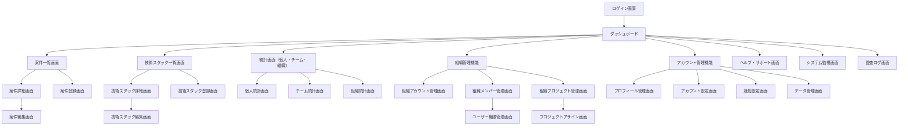

# stackies!(技術スタック・案件管理システム) 画面一覧

## 1. 画面一覧表

| カテゴリ | 画面名 | 機能 | 主要コンポーネント | 遷移先 |
|----------|--------|------|-------------------|---------|
| **認証** | ログイン画面 | ユーザー認証 | ログインフォーム、ソーシャルログインボタン（Google、GitHub、LinkedIn）、パスワードリセットリンク、MFA設定 | ダッシュボード |
| **認証** | ユーザー登録画面 | 新規ユーザー登録 | 登録フォーム、メールアドレス認証、利用規約、ソーシャル登録オプション | ダッシュボード |
| **認証** | パスワードリセット画面 | パスワード再設定 | メールアドレス入力、認証コード入力、新パスワード設定 | ログイン画面 |
| **認証** | アカウントアクティベーション画面 | アカウント有効化 | 認証コード入力、アカウント有効化ボタン | ダッシュボード |
| **メイン** | ダッシュボード | システム全体の統計サマリー表示 | 技術スタック統計グラフ、最近の案件一覧、スキルレベル分布、経験年数ランキング（TOP5） | 各詳細画面 |
| **メイン** | ナビゲーションメニュー | 各画面への遷移 | グローバルナビゲーション、ユーザーメニュー | - |
| **案件管理** | 案件一覧画面 | 登録済み案件の一覧表示 | 案件リスト（案件名、期間、ポジション）、検索・フィルター機能、ソート機能、新規登録ボタン | 案件詳細画面、案件登録・編集画面 |
| **案件管理** | 案件詳細画面 | 案件の詳細情報表示 | 案件基本情報、使用技術スタック一覧、感想・コメント、編集・削除ボタン | 案件編集画面、技術スタック詳細画面 |
| **案件管理** | 案件登録画面 | 新規案件の登録 | 案件情報入力フォーム、技術スタック選択・追加、保存・キャンセルボタン | 案件詳細画面、案件一覧画面 |
| **案件管理** | 案件編集画面 | 既存案件の編集 | 案件情報編集フォーム、技術スタック編集、更新・キャンセル・削除ボタン | 案件詳細画面、案件一覧画面 |
| **技術スタック** | 技術スタック一覧画面 | 技術スタックの一覧表示 | 技術スタックリスト（技術名、カテゴリ、スキルレベル、経験年数）、カテゴリ別フィルター、スキルレベル別ソート、新規登録ボタン | 技術スタック詳細画面、技術スタック登録・編集画面 |
| **技術スタック** | 技術スタック詳細画面 | 技術スタックの詳細情報表示 | 技術基本情報、使用案件一覧、経験年数の詳細、スキルレベル更新機能、編集・削除ボタン | 技術スタック編集画面、案件詳細画面 |
| **技術スタック** | 技術スタック登録画面 | 新規技術スタックの登録 | 技術情報入力フォーム、カテゴリ選択、初期スキルレベル設定、保存・キャンセルボタン | 技術スタック詳細画面、技術スタック一覧画面 |
| **技術スタック** | 技術スタック編集画面 | 既存技術スタックの編集 | 技術情報編集フォーム、スキルレベル更新、更新・キャンセル・削除ボタン | 技術スタック詳細画面、技術スタック一覧画面 |
| **アカウント管理** | プロフィール管理画面 | 個人情報・キャリア情報管理 | 基本情報編集フォーム、アバター管理、キャリア情報編集、ソーシャルリンク設定、公開レベル設定 | ダッシュボード |
| **アカウント管理** | アカウント設定画面 | アカウント設定管理 | 言語・タイムゾーン設定、パスワード変更、MFA設定、セッション管理、ログイン履歴 | プロフィール管理画面 |
| **アカウント管理** | 通知設定画面 | 通知設定管理 | メール通知設定、プッシュ通知設定、Slack/Teams連携設定、通知頻度設定 | アカウント設定画面 |
| **アカウント管理** | データ管理画面 | データエクスポート・インポート | データエクスポート機能、データインポート機能、バックアップ・リストア、データ削除 | アカウント設定画面 |
| **統計・レポート** | 個人統計画面 | 個人レベルの統計表示 | 技術別経験年数ランキング、カテゴリ別技術分布、スキルレベル別技術一覧、年別案件数、ポジション別案件分析、期間別技術トレンド | 技術スタック詳細画面、案件詳細画面 |
| **統計・レポート** | チーム統計画面 | チームレベルの統計表示 | チーム技術ポートフォリオ、メンバー間スキルギャップ分析、スキルマトリックス（ヒートマップ）、技術習得進捗トラッキング | 組織管理画面 |
| **統計・レポート** | 組織統計画面 | 組織レベルの統計表示 | 組織技術競争力分析、部署・チーム間スキル比較、人材リソース配置最適化推奨、組織スキルロードマップ、人材育成ROI分析 | 組織管理画面 |
| **組織管理** | 組織アカウント管理画面 | 組織情報・サブスクリプション管理 | 組織情報編集、サブスクリプションプラン管理、課金・支払い情報、組織設定、ドメイン認証設定 | 組織メンバー管理画面 |
| **組織管理** | 組織メンバー管理画面 | メンバー招待・管理 | ユーザー一覧・検索、メール招待機能、ロール・権限管理、ユーザーステータス管理、CSVインポート、AD/LDAP連携 | ユーザー権限管理画面 |
| **組織管理** | 組織プロジェクト管理画面 | 組織内プロジェクト管理 | プロジェクト一覧、メンバーアサイン機能、スキルマッチング、ワークロード平均化、アサイン履歴 | プロジェクトアサイン画面 |
| **組織管理** | プロジェクトアサイン画面 | プロジェクトメンバー最適化 | 要件ベース最適メンバー推奨、スキルマッチングアルゴリズム、ワークロード可視化、アサイン実行 | 組織プロジェクト管理画面 |
| **権限管理** | ユーザー権限管理画面 | ロール・権限設定 | ロール定義管理、権限設定（リソースレベル）、動的権限変更、ユーザーグループ管理、権限変更履歴 | 組織メンバー管理画面 |
| **権限管理** | データアクセス制御画面 | データアクセス権限管理 | 組織間データ分離設定、個人情報プライバシー設定、チーム横断情報表示制御、機密情報マスキング設定 | ユーザー権限管理画面 |
| **設定・その他** | ヘルプ・サポート画面 | 使い方の説明とサポート | FAQ、操作ガイド、お問い合わせフォーム | - |
| **システム管理** | システム監視画面 | システム稼働状況監視 | システムパフォーマンス監視、アプリケーションログ監視、ユーザー行動分析、SLA監視ダッシュボード | - |
| **システム管理** | 監査ログ画面 | システム監査ログ表示 | 全アクセスログ、ユーザー操作履歴、コンプライアンスレポート、外部監査対応機能 | - |

## 2. 共通コンポーネント

| 種類 | コンポーネント名 | 用途 |
|------|-----------------|------|
| **モーダル・ダイアログ** | 削除確認ダイアログ | データ削除前の確認 |
| **モーダル・ダイアログ** | エラーメッセージダイアログ | エラー情報の表示 |
| **モーダル・ダイアログ** | 成功通知ダイアログ | 操作成功の通知 |
| **システム画面** | ローディング画面 | データ読み込み中の表示 |
| **システム画面** | エラー画面（404、500等） | システムエラーの表示 |
| **システム画面** | ネットワークエラー画面 | 通信エラーの表示 |

## 3. レスポンシブ対応

| デバイス | 表示特徴 | 対応内容 |
|----------|----------|----------|
| **PC版** | フル機能での表示 | サイドナビゲーション、詳細情報の同時表示 |
| **タブレット版** | 縮約されたナビゲーション | 適応的なレイアウト、タッチ操作に最適化 |
| **スマートフォン版** | ハンバーガーメニュー | モバイルファーストデザイン、必要最小限の情報表示、タップ操作に最適化 |

## 4. ユーザーロール別アクセス権限

| ユーザーロール | アクセス可能範囲 |
|-------------|----------------|
| **システム管理者** | システム全体の管理権限、全ユーザー・組織データのアクセス・管理、システム監視・監査ログ画面 |
| **組織管理者** | 所属組織内の全データアクセス・管理権限、組織管理機能、組織統計画面、メンバー管理・権限設定 |
| **チームリーダー** | 担当チームのデータ参照・管理権限、チーム統計画面、チームメンバーの案件・スキル情報アクセス |
| **プロジェクトマネージャー** | 担当プロジェクトのデータ参照・管理権限、プロジェクトアサイン機能、プロジェクトメンバー情報アクセス |
| **一般ユーザー（エンジニア）** | 自分のデータのみ管理権限、個人統計画面、自身の案件・技術スタック管理 |
| **閲覧ユーザー** | 指定されたデータの参照のみ、制限された統計情報の閲覧 |
| **未認証ユーザー** | ログイン画面、ユーザー登録画面、パスワードリセット画面のみアクセス可能 |

## 9. 画面遷移フロー

## 10. 機能別アクセス制御

### 10.1 個人データ管理機能
- **一般ユーザー以上**：自身の案件・技術スタック・プロフィール情報の作成・編集・削除
- **チームリーダー以上**：チームメンバーの情報閲覧
- **組織管理者以上**：組織内全メンバーの情報閲覧・管理

### 10.2 組織管理機能
- **組織管理者以上**：組織設定、メンバー招待・管理、ロール・権限設定
- **システム管理者**：全組織の管理、システム全体の設定

### 10.3 統計・レポート機能
- **一般ユーザー**：個人統計のみ
- **チームリーダー**：担当チーム統計まで
- **組織管理者**：組織全体統計まで
- **システム管理者**：全統計データおよびシステム監視データ

### 10.4 プロジェクトアサイン機能
- **プロジェクトマネージャー以上**：担当プロジェクトのメンバーアサイン
- **チームリーダー以上**：チーム内でのアサイン調整
- **組織管理者以上**：組織内全プロジェクトのアサイン管理

### 10.5 システム管理機能
- **システム管理者のみ**：システム監視、監査ログ、全システム設定の管理