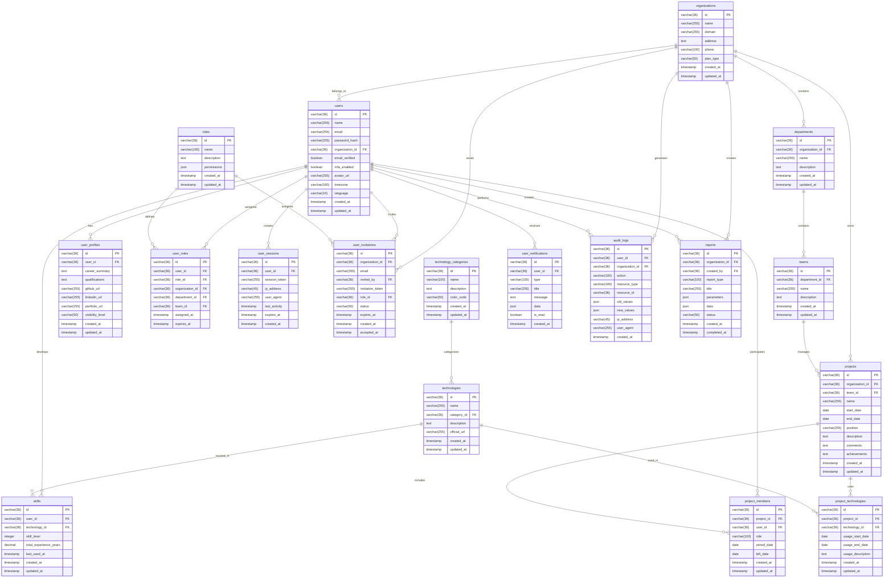

# stackies!(技術スタック・案件管理システム) データベース設計

## 1. データベース概要

技術スタック・案件管理システムのためのデータベース設計書。
マルチテナント対応および組織管理機能を含む、要件定義に基づく包括的なデータベース設計を定義する。

## 2. ER図



## 3. テーブル定義

### 3.1 organizations（組織）

| カラム名 | データ型 | 制約 | 説明 |
|----------|----------|------|------|
| id | VARCHAR(36) | PRIMARY KEY | 組織ID（UUID） |
| name | VARCHAR(255) | NOT NULL | 組織名 |
| domain | VARCHAR(255) | UNIQUE | ドメイン名 |
| address | TEXT | NULL | 住所 |
| phone | VARCHAR(100) | NULL | 電話番号 |
| plan_type | VARCHAR(50) | NOT NULL | プランタイプ |
| created_at | TIMESTAMP | NOT NULL | 作成日時 |
| updated_at | TIMESTAMP | NOT NULL | 更新日時 |

### 3.2 departments（部署）

| カラム名 | データ型 | 制約 | 説明 |
|----------|----------|------|------|
| id | VARCHAR(36) | PRIMARY KEY | 部署ID（UUID） |
| organization_id | VARCHAR(36) | NOT NULL, FOREIGN KEY | 組織ID |
| name | VARCHAR(255) | NOT NULL | 部署名 |
| description | TEXT | NULL | 説明 |
| created_at | TIMESTAMP | NOT NULL | 作成日時 |
| updated_at | TIMESTAMP | NOT NULL | 更新日時 |

### 3.3 teams（チーム）

| カラム名 | データ型 | 制約 | 説明 |
|----------|----------|------|------|
| id | VARCHAR(36) | PRIMARY KEY | チームID（UUID） |
| department_id | VARCHAR(36) | NOT NULL, FOREIGN KEY | 部署ID |
| name | VARCHAR(255) | NOT NULL | チーム名 |
| description | TEXT | NULL | 説明 |
| created_at | TIMESTAMP | NOT NULL | 作成日時 |
| updated_at | TIMESTAMP | NOT NULL | 更新日時 |

### 3.4 roles（ロール）

| カラム名 | データ型 | 制約 | 説明 |
|----------|----------|------|------|
| id | VARCHAR(36) | PRIMARY KEY | ロールID（UUID） |
| name | VARCHAR(100) | NOT NULL, UNIQUE | ロール名 |
| description | TEXT | NULL | 説明 |
| permissions | JSON | NOT NULL | 権限リスト |
| created_at | TIMESTAMP | NOT NULL | 作成日時 |
| updated_at | TIMESTAMP | NOT NULL | 更新日時 |

### 3.5 users（ユーザー）

| カラム名 | データ型 | 制約 | 説明 |
|----------|----------|------|------|
| id | VARCHAR(36) | PRIMARY KEY | ユーザーID（UUID） |
| name | VARCHAR(255) | NOT NULL | ユーザー名 |
| email | VARCHAR(255) | NOT NULL, UNIQUE | メールアドレス |
| password_hash | VARCHAR(255) | NOT NULL | パスワードハッシュ |
| organization_id | VARCHAR(36) | NOT NULL, FOREIGN KEY | 組織ID |
| email_verified | BOOLEAN | NOT NULL, DEFAULT FALSE | メール認証済みフラグ |
| mfa_enabled | BOOLEAN | NOT NULL, DEFAULT FALSE | MFA有効フラグ |
| avatar_url | VARCHAR(255) | NULL | アバター画像URL |
| timezone | VARCHAR(100) | NULL | タイムゾーン |
| language | VARCHAR(10) | NOT NULL, DEFAULT 'ja' | 言語設定 |
| created_at | TIMESTAMP | NOT NULL | 作成日時 |
| updated_at | TIMESTAMP | NOT NULL | 更新日時 |

### 3.6 user_profiles（ユーザープロフィール）

| カラム名 | データ型 | 制約 | 説明 |
|----------|----------|------|------|
| id | VARCHAR(36) | PRIMARY KEY | プロフィールID（UUID） |
| user_id | VARCHAR(36) | NOT NULL, FOREIGN KEY | ユーザーID |
| career_summary | TEXT | NULL | 経歴サマリー |
| qualifications | TEXT | NULL | 保有資格 |
| github_url | VARCHAR(255) | NULL | GitHub URL |
| linkedin_url | VARCHAR(255) | NULL | LinkedIn URL |
| portfolio_url | VARCHAR(255) | NULL | ポートフォリオURL |
| visibility_level | VARCHAR(50) | NOT NULL, DEFAULT 'private' | 公開レベル |
| created_at | TIMESTAMP | NOT NULL | 作成日時 |
| updated_at | TIMESTAMP | NOT NULL | 更新日時 |

### 3.7 user_roles（ユーザーロール）

| カラム名 | データ型 | 制約 | 説明 |
|----------|----------|------|------|
| id | VARCHAR(36) | PRIMARY KEY | ユーザーロールID（UUID） |
| user_id | VARCHAR(36) | NOT NULL, FOREIGN KEY | ユーザーID |
| role_id | VARCHAR(36) | NOT NULL, FOREIGN KEY | ロールID |
| organization_id | VARCHAR(36) | NULL, FOREIGN KEY | 組織ID |
| department_id | VARCHAR(36) | NULL, FOREIGN KEY | 部署ID |
| team_id | VARCHAR(36) | NULL, FOREIGN KEY | チームID |
| assigned_at | TIMESTAMP | NOT NULL | 割り当て日時 |
| expires_at | TIMESTAMP | NULL | 有効期限 |

### 3.8 user_sessions（ユーザーセッション）

| カラム名 | データ型 | 制約 | 説明 |
|----------|----------|------|------|
| id | VARCHAR(36) | PRIMARY KEY | セッションID（UUID） |
| user_id | VARCHAR(36) | NOT NULL, FOREIGN KEY | ユーザーID |
| session_token | VARCHAR(255) | NOT NULL, UNIQUE | セッショントークン |
| ip_address | VARCHAR(45) | NOT NULL | IPアドレス |
| user_agent | VARCHAR(255) | NOT NULL | ユーザーエージェント |
| last_activity | TIMESTAMP | NOT NULL | 最終アクティビティ |
| expires_at | TIMESTAMP | NOT NULL | 有効期限 |
| created_at | TIMESTAMP | NOT NULL | 作成日時 |

### 3.9 user_invitations（ユーザー招待）

| カラム名 | データ型 | 制約 | 説明 |
|----------|----------|------|------|
| id | VARCHAR(36) | PRIMARY KEY | 招待ID（UUID） |
| organization_id | VARCHAR(36) | NOT NULL, FOREIGN KEY | 組織ID |
| email | VARCHAR(255) | NOT NULL | 招待先メールアドレス |
| invited_by | VARCHAR(36) | NOT NULL, FOREIGN KEY | 招待者ID |
| invitation_token | VARCHAR(255) | NOT NULL, UNIQUE | 招待トークン |
| role_id | VARCHAR(36) | NOT NULL, FOREIGN KEY | 割り当てロールID |
| status | VARCHAR(50) | NOT NULL, DEFAULT 'pending' | ステータス |
| expires_at | TIMESTAMP | NOT NULL | 有効期限 |
| created_at | TIMESTAMP | NOT NULL | 作成日時 |
| accepted_at | TIMESTAMP | NULL | 承認日時 |

### 3.10 projects（案件）

| カラム名 | データ型 | 制約 | 説明 |
|----------|----------|------|------|
| id | VARCHAR(36) | PRIMARY KEY | 案件ID（UUID） |
| organization_id | VARCHAR(36) | NOT NULL, FOREIGN KEY | 組織ID |
| team_id | VARCHAR(36) | NULL, FOREIGN KEY | チームID |
| name | VARCHAR(255) | NOT NULL | 案件名 |
| start_date | DATE | NOT NULL | 開始日 |
| end_date | DATE | NULL | 終了日 |
| position | VARCHAR(255) | NOT NULL | 担当ポジション |
| description | TEXT | NULL | プロジェクト概要 |
| comments | TEXT | NULL | 感想・コメント |
| achievements | TEXT | NULL | 成果・実績 |
| created_at | TIMESTAMP | NOT NULL | 作成日時 |
| updated_at | TIMESTAMP | NOT NULL | 更新日時 |

### 3.11 project_members（プロジェクトメンバー）

| カラム名 | データ型 | 制約 | 説明 |
|----------|----------|------|------|
| id | VARCHAR(36) | PRIMARY KEY | メンバーID（UUID） |
| project_id | VARCHAR(36) | NOT NULL, FOREIGN KEY | 案件ID |
| user_id | VARCHAR(36) | NOT NULL, FOREIGN KEY | ユーザーID |
| role | VARCHAR(100) | NOT NULL | プロジェクト内役割 |
| joined_date | DATE | NOT NULL | 参加日 |
| left_date | DATE | NULL | 離脱日 |
| created_at | TIMESTAMP | NOT NULL | 作成日時 |
| updated_at | TIMESTAMP | NOT NULL | 更新日時 |

### 3.12 technology_categories（技術カテゴリ）

| カラム名 | データ型 | 制約 | 説明 |
|----------|----------|------|------|
| id | VARCHAR(36) | PRIMARY KEY | カテゴリID（UUID） |
| name | VARCHAR(100) | NOT NULL, UNIQUE | カテゴリ名 |
| description | TEXT | NULL | 説明 |
| color_code | VARCHAR(50) | NULL | 表示用カラーコード |
| created_at | TIMESTAMP | NOT NULL | 作成日時 |
| updated_at | TIMESTAMP | NOT NULL | 更新日時 |

### 3.13 technologies（技術スタック）

| カラム名 | データ型 | 制約 | 説明 |
|----------|----------|------|------|
| id | VARCHAR(36) | PRIMARY KEY | 技術ID（UUID） |
| name | VARCHAR(255) | NOT NULL, UNIQUE | 技術名 |
| category_id | VARCHAR(36) | NOT NULL, FOREIGN KEY | カテゴリID |
| description | TEXT | NULL | 説明 |
| official_url | VARCHAR(255) | NULL | 公式サイトURL |
| created_at | TIMESTAMP | NOT NULL | 作成日時 |
| updated_at | TIMESTAMP | NOT NULL | 更新日時 |

### 3.14 skills（スキル情報）

| カラム名 | データ型 | 制約 | 説明 |
|----------|----------|------|------|
| id | VARCHAR(36) | PRIMARY KEY | スキルID（UUID） |
| user_id | VARCHAR(36) | NOT NULL, FOREIGN KEY | ユーザーID |
| technology_id | VARCHAR(36) | NOT NULL, FOREIGN KEY | 技術ID |
| skill_level | INTEGER | NOT NULL, CHECK(1-5) | スキルレベル（1-5） |
| total_experience_years | DECIMAL(4,2) | NOT NULL, DEFAULT 0 | 累計経験年数 |
| last_used_at | TIMESTAMP | NULL | 最終使用日 |
| created_at | TIMESTAMP | NOT NULL | 作成日時 |
| updated_at | TIMESTAMP | NOT NULL | 更新日時 |

### 3.15 project_technologies（案件-技術関連）

| カラム名 | データ型 | 制約 | 説明 |
|----------|----------|------|------|
| id | VARCHAR(36) | PRIMARY KEY | 関連ID（UUID） |
| project_id | VARCHAR(36) | NOT NULL, FOREIGN KEY | 案件ID |
| technology_id | VARCHAR(36) | NOT NULL, FOREIGN KEY | 技術ID |
| usage_start_date | DATE | NOT NULL | 使用開始日 |
| usage_end_date | DATE | NULL | 使用終了日 |
| usage_description | TEXT | NULL | 使用内容詳細 |
| created_at | TIMESTAMP | NOT NULL | 作成日時 |
| updated_at | TIMESTAMP | NOT NULL | 更新日時 |

### 3.16 user_notifications（ユーザー通知）

| カラム名 | データ型 | 制約 | 説明 |
|----------|----------|------|------|
| id | VARCHAR(36) | PRIMARY KEY | 通知ID（UUID） |
| user_id | VARCHAR(36) | NOT NULL, FOREIGN KEY | ユーザーID |
| type | VARCHAR(100) | NOT NULL | 通知タイプ |
| title | VARCHAR(255) | NOT NULL | タイトル |
| message | TEXT | NOT NULL | メッセージ |
| data | JSON | NULL | 追加データ |
| is_read | BOOLEAN | NOT NULL, DEFAULT FALSE | 既読フラグ |
| created_at | TIMESTAMP | NOT NULL | 作成日時 |

### 3.17 audit_logs（監査ログ）

| カラム名 | データ型 | 制約 | 説明 |
|----------|----------|------|------|
| id | VARCHAR(36) | PRIMARY KEY | ログID（UUID） |
| user_id | VARCHAR(36) | NULL, FOREIGN KEY | ユーザーID |
| organization_id | VARCHAR(36) | NOT NULL, FOREIGN KEY | 組織ID |
| action | VARCHAR(100) | NOT NULL | アクション |
| resource_type | VARCHAR(100) | NOT NULL | リソースタイプ |
| resource_id | VARCHAR(36) | NULL | リソースID |
| old_values | JSON | NULL | 変更前の値 |
| new_values | JSON | NULL | 変更後の値 |
| ip_address | VARCHAR(45) | NOT NULL | IPアドレス |
| user_agent | VARCHAR(255) | NOT NULL | ユーザーエージェント |
| created_at | TIMESTAMP | NOT NULL | 作成日時 |

### 3.18 reports（レポート）

| カラム名 | データ型 | 制約 | 説明 |
|----------|----------|------|------|
| id | VARCHAR(36) | PRIMARY KEY | レポートID（UUID） |
| organization_id | VARCHAR(36) | NOT NULL, FOREIGN KEY | 組織ID |
| created_by | VARCHAR(36) | NOT NULL, FOREIGN KEY | 作成者ID |
| report_type | VARCHAR(100) | NOT NULL | レポートタイプ |
| title | VARCHAR(255) | NOT NULL | タイトル |
| parameters | JSON | NULL | パラメータ |
| data | JSON | NULL | レポートデータ |
| status | VARCHAR(50) | NOT NULL, DEFAULT 'pending' | ステータス |
| created_at | TIMESTAMP | NOT NULL | 作成日時 |
| completed_at | TIMESTAMP | NULL | 完了日時 |

## 4. インデックス設計

### 4.1 主要インデックス

```sql
-- organizations テーブル
CREATE UNIQUE INDEX idx_organizations_domain ON organizations(domain);

-- departments テーブル
CREATE INDEX idx_departments_organization_id ON departments(organization_id);
CREATE UNIQUE INDEX idx_departments_org_name ON departments(organization_id, name);

-- teams テーブル
CREATE INDEX idx_teams_department_id ON teams(department_id);
CREATE UNIQUE INDEX idx_teams_dept_name ON teams(department_id, name);

-- roles テーブル
CREATE UNIQUE INDEX idx_roles_name ON roles(name);

-- users テーブル
CREATE UNIQUE INDEX idx_users_email ON users(email);
CREATE INDEX idx_users_organization_id ON users(organization_id);
CREATE INDEX idx_users_email_verified ON users(email_verified);

-- user_profiles テーブル
CREATE UNIQUE INDEX idx_user_profiles_user_id ON user_profiles(user_id);
CREATE INDEX idx_user_profiles_visibility ON user_profiles(visibility_level);

-- user_roles テーブル
CREATE INDEX idx_user_roles_user_id ON user_roles(user_id);
CREATE INDEX idx_user_roles_role_id ON user_roles(role_id);
CREATE INDEX idx_user_roles_organization_id ON user_roles(organization_id);
CREATE INDEX idx_user_roles_expires_at ON user_roles(expires_at);

-- user_sessions テーブル
CREATE UNIQUE INDEX idx_user_sessions_token ON user_sessions(session_token);
CREATE INDEX idx_user_sessions_user_id ON user_sessions(user_id);
CREATE INDEX idx_user_sessions_expires_at ON user_sessions(expires_at);

-- user_invitations テーブル
CREATE UNIQUE INDEX idx_user_invitations_token ON user_invitations(invitation_token);
CREATE INDEX idx_user_invitations_organization_id ON user_invitations(organization_id);
CREATE INDEX idx_user_invitations_email ON user_invitations(email);
CREATE INDEX idx_user_invitations_status ON user_invitations(status);
CREATE INDEX idx_user_invitations_expires_at ON user_invitations(expires_at);

-- projects テーブル
CREATE INDEX idx_projects_organization_id ON projects(organization_id);
CREATE INDEX idx_projects_team_id ON projects(team_id);
CREATE INDEX idx_projects_start_date ON projects(start_date);
CREATE INDEX idx_projects_end_date ON projects(end_date);

-- project_members テーブル
CREATE INDEX idx_project_members_project_id ON project_members(project_id);
CREATE INDEX idx_project_members_user_id ON project_members(user_id);
CREATE UNIQUE INDEX idx_project_members_unique ON project_members(project_id, user_id);

-- technology_categories テーブル
CREATE UNIQUE INDEX idx_technology_categories_name ON technology_categories(name);

-- technologies テーブル
CREATE UNIQUE INDEX idx_technologies_name ON technologies(name);
CREATE INDEX idx_technologies_category_id ON technologies(category_id);

-- skills テーブル
CREATE INDEX idx_skills_user_id ON skills(user_id);
CREATE INDEX idx_skills_technology_id ON skills(technology_id);
CREATE UNIQUE INDEX idx_skills_user_technology ON skills(user_id, technology_id);
CREATE INDEX idx_skills_last_used_at ON skills(last_used_at);

-- project_technologies テーブル
CREATE INDEX idx_project_technologies_project_id ON project_technologies(project_id);
CREATE INDEX idx_project_technologies_technology_id ON project_technologies(technology_id);
CREATE UNIQUE INDEX idx_project_technologies_unique ON project_technologies(project_id, technology_id);

-- user_notifications テーブル
CREATE INDEX idx_user_notifications_user_id ON user_notifications(user_id);
CREATE INDEX idx_user_notifications_type ON user_notifications(type);
CREATE INDEX idx_user_notifications_is_read ON user_notifications(is_read);
CREATE INDEX idx_user_notifications_created_at ON user_notifications(created_at);

-- audit_logs テーブル
CREATE INDEX idx_audit_logs_user_id ON audit_logs(user_id);
CREATE INDEX idx_audit_logs_organization_id ON audit_logs(organization_id);
CREATE INDEX idx_audit_logs_action ON audit_logs(action);
CREATE INDEX idx_audit_logs_resource_type ON audit_logs(resource_type);
CREATE INDEX idx_audit_logs_created_at ON audit_logs(created_at);

-- reports テーブル
CREATE INDEX idx_reports_organization_id ON reports(organization_id);
CREATE INDEX idx_reports_created_by ON reports(created_by);
CREATE INDEX idx_reports_type ON reports(report_type);
CREATE INDEX idx_reports_status ON reports(status);
CREATE INDEX idx_reports_created_at ON reports(created_at);
```

## 5. 制約定義

### 5.1 外部キー制約

```sql
-- departments テーブル
ALTER TABLE departments ADD CONSTRAINT fk_departments_organization_id 
    FOREIGN KEY (organization_id) REFERENCES organizations(id) ON DELETE CASCADE;

-- teams テーブル
ALTER TABLE teams ADD CONSTRAINT fk_teams_department_id 
    FOREIGN KEY (department_id) REFERENCES departments(id) ON DELETE CASCADE;

-- users テーブル
ALTER TABLE users ADD CONSTRAINT fk_users_organization_id 
    FOREIGN KEY (organization_id) REFERENCES organizations(id) ON DELETE RESTRICT;

-- user_profiles テーブル
ALTER TABLE user_profiles ADD CONSTRAINT fk_user_profiles_user_id 
    FOREIGN KEY (user_id) REFERENCES users(id) ON DELETE CASCADE;

-- user_roles テーブル
ALTER TABLE user_roles ADD CONSTRAINT fk_user_roles_user_id 
    FOREIGN KEY (user_id) REFERENCES users(id) ON DELETE CASCADE;
ALTER TABLE user_roles ADD CONSTRAINT fk_user_roles_role_id 
    FOREIGN KEY (role_id) REFERENCES roles(id) ON DELETE CASCADE;
ALTER TABLE user_roles ADD CONSTRAINT fk_user_roles_organization_id 
    FOREIGN KEY (organization_id) REFERENCES organizations(id) ON DELETE CASCADE;
ALTER TABLE user_roles ADD CONSTRAINT fk_user_roles_department_id 
    FOREIGN KEY (department_id) REFERENCES departments(id) ON DELETE CASCADE;
ALTER TABLE user_roles ADD CONSTRAINT fk_user_roles_team_id 
    FOREIGN KEY (team_id) REFERENCES teams(id) ON DELETE CASCADE;

-- user_sessions テーブル
ALTER TABLE user_sessions ADD CONSTRAINT fk_user_sessions_user_id 
    FOREIGN KEY (user_id) REFERENCES users(id) ON DELETE CASCADE;

-- user_invitations テーブル
ALTER TABLE user_invitations ADD CONSTRAINT fk_user_invitations_organization_id 
    FOREIGN KEY (organization_id) REFERENCES organizations(id) ON DELETE CASCADE;
ALTER TABLE user_invitations ADD CONSTRAINT fk_user_invitations_invited_by 
    FOREIGN KEY (invited_by) REFERENCES users(id) ON DELETE CASCADE;
ALTER TABLE user_invitations ADD CONSTRAINT fk_user_invitations_role_id 
    FOREIGN KEY (role_id) REFERENCES roles(id) ON DELETE CASCADE;

-- projects テーブル
ALTER TABLE projects ADD CONSTRAINT fk_projects_organization_id 
    FOREIGN KEY (organization_id) REFERENCES organizations(id) ON DELETE CASCADE;
ALTER TABLE projects ADD CONSTRAINT fk_projects_team_id 
    FOREIGN KEY (team_id) REFERENCES teams(id) ON DELETE SET NULL;

-- project_members テーブル
ALTER TABLE project_members ADD CONSTRAINT fk_project_members_project_id 
    FOREIGN KEY (project_id) REFERENCES projects(id) ON DELETE CASCADE;
ALTER TABLE project_members ADD CONSTRAINT fk_project_members_user_id 
    FOREIGN KEY (user_id) REFERENCES users(id) ON DELETE CASCADE;

-- technologies テーブル
ALTER TABLE technologies ADD CONSTRAINT fk_technologies_category_id 
    FOREIGN KEY (category_id) REFERENCES technology_categories(id) ON DELETE RESTRICT;

-- skills テーブル
ALTER TABLE skills ADD CONSTRAINT fk_skills_user_id 
    FOREIGN KEY (user_id) REFERENCES users(id) ON DELETE CASCADE;
ALTER TABLE skills ADD CONSTRAINT fk_skills_technology_id 
    FOREIGN KEY (technology_id) REFERENCES technologies(id) ON DELETE CASCADE;

-- project_technologies テーブル
ALTER TABLE project_technologies ADD CONSTRAINT fk_project_technologies_project_id 
    FOREIGN KEY (project_id) REFERENCES projects(id) ON DELETE CASCADE;
ALTER TABLE project_technologies ADD CONSTRAINT fk_project_technologies_technology_id 
    FOREIGN KEY (technology_id) REFERENCES technologies(id) ON DELETE CASCADE;

-- user_notifications テーブル
ALTER TABLE user_notifications ADD CONSTRAINT fk_user_notifications_user_id 
    FOREIGN KEY (user_id) REFERENCES users(id) ON DELETE CASCADE;

-- audit_logs テーブル
ALTER TABLE audit_logs ADD CONSTRAINT fk_audit_logs_user_id 
    FOREIGN KEY (user_id) REFERENCES users(id) ON DELETE SET NULL;
ALTER TABLE audit_logs ADD CONSTRAINT fk_audit_logs_organization_id 
    FOREIGN KEY (organization_id) REFERENCES organizations(id) ON DELETE CASCADE;

-- reports テーブル
ALTER TABLE reports ADD CONSTRAINT fk_reports_organization_id 
    FOREIGN KEY (organization_id) REFERENCES organizations(id) ON DELETE CASCADE;
ALTER TABLE reports ADD CONSTRAINT fk_reports_created_by 
    FOREIGN KEY (created_by) REFERENCES users(id) ON DELETE SET NULL;
```

### 5.2 チェック制約

```sql
-- organizations テーブル
ALTER TABLE organizations ADD CONSTRAINT chk_plan_type 
    CHECK (plan_type IN ('free', 'standard', 'premium', 'enterprise'));

-- users テーブル
ALTER TABLE users ADD CONSTRAINT chk_language 
    CHECK (language IN ('ja', 'en', 'zh', 'ko'));

-- user_profiles テーブル
ALTER TABLE user_profiles ADD CONSTRAINT chk_visibility_level 
    CHECK (visibility_level IN ('private', 'organization', 'public'));

-- user_invitations テーブル
ALTER TABLE user_invitations ADD CONSTRAINT chk_invitation_status 
    CHECK (status IN ('pending', 'accepted', 'expired', 'revoked'));

-- skills テーブル
ALTER TABLE skills ADD CONSTRAINT chk_skill_level 
    CHECK (skill_level >= 1 AND skill_level <= 5);
ALTER TABLE skills ADD CONSTRAINT chk_total_experience_years 
    CHECK (total_experience_years >= 0);

-- projects テーブル
ALTER TABLE projects ADD CONSTRAINT chk_project_dates 
    CHECK (end_date IS NULL OR start_date <= end_date);

-- project_members テーブル
ALTER TABLE project_members ADD CONSTRAINT chk_member_dates 
    CHECK (left_date IS NULL OR joined_date <= left_date);

-- project_technologies テーブル
ALTER TABLE project_technologies ADD CONSTRAINT chk_usage_dates 
    CHECK (usage_end_date IS NULL OR usage_start_date <= usage_end_date);

-- user_notifications テーブル
ALTER TABLE user_notifications ADD CONSTRAINT chk_notification_type 
    CHECK (type IN ('system', 'project', 'skill', 'invitation', 'security'));

-- audit_logs テーブル
ALTER TABLE audit_logs ADD CONSTRAINT chk_audit_action 
    CHECK (action IN ('create', 'read', 'update', 'delete', 'login', 'logout', 'export', 'import'));
ALTER TABLE audit_logs ADD CONSTRAINT chk_resource_type 
    CHECK (resource_type IN ('user', 'project', 'skill', 'technology', 'organization', 'role'));

-- reports テーブル
ALTER TABLE reports ADD CONSTRAINT chk_report_type 
    CHECK (report_type IN ('user_skill', 'team_analysis', 'organization_metrics', 'compliance'));
ALTER TABLE reports ADD CONSTRAINT chk_report_status 
    CHECK (status IN ('pending', 'processing', 'completed', 'failed'));
```

## 6. データ整合性とビジネスルール

### 6.1 マルチテナント分離

- 組織間データの完全分離（organization_id による論理分離）
- テナント横断アクセスの防止（アプリケーションレベルでの制御）
- 組織削除時の関連データ一括削除（監査ログ除く）

### 6.2 ユーザー認証とセッション管理

- パスワードのハッシュ化保存（bcrypt推奨）
- セッション有効期限の適切な管理
- MFA設定時の追加認証情報管理
- ログイン履歴の長期保存（コンプライアンス対応）

### 6.3 権限管理

- ロールベースアクセス制御（RBAC）の実装
- 組織・部署・チームレベルでの権限設定
- 期限付きロール割り当ての自動期限切れ処理
- 権限変更時の監査ログ記録

### 6.4 経験年数計算ルール

- 累計経験年数は project_technologies テーブルの使用期間から自動計算
- 重複期間は重複カウントしない（同一期間に複数案件で同じ技術を使用した場合）
- 案件が進行中（end_date が NULL）の場合は現在日付までで計算
- プロジェクトメンバーとしての参加期間を考慮した計算

### 6.5 スキルレベル管理

- スキルレベルは1-5の整数値（⭐️1〜5に対応）
- 手動更新可能
- 経験年数に基づく自動推定機能も今後実装予定
- 最終使用日の自動更新

### 6.6 削除時の整合性

- 組織削除時：関連する全データをカスケード削除（監査ログは残存）
- ユーザー削除時：関連する全データをカスケード削除
- 技術削除時：関連するスキル情報と案件関連情報をカスケード削除
- 案件削除時：関連する技術使用情報とメンバー情報をカスケード削除

### 6.7 監査とトレーサビリティ

- 全ての変更操作を audit_logs テーブルに記録
- ユーザー操作のトレーサビリティ確保
- 7年間の監査ログ保存（コンプライアンス要件）
- 個人情報変更時の特別な監査記録

## 7. パフォーマンス考慮事項

### 7.1 クエリ最適化

- 組織別データ取得時のインデックス活用
- ユーザー別の技術スタック一覧取得時のインデックス活用
- 期間指定による案件検索の最適化
- カテゴリ別技術一覧表示の最適化
- 権限チェック時のロール関連テーブルのジョイン最適化

### 7.2 データ量想定（スケール対応）

#### 組織レベル
- 最大1,000組織まで対応
- 1組織あたり最大10,000ユーザー
- 部署数：1組織あたり50部署程度
- チーム数：1部署あたり20チーム程度

#### ユーザーレベル
- 1ユーザーあたり：
  - 案件数：年間10件程度
  - 技術スタック：50-100件程度
  - 案件-技術関連：案件あたり5-10件程度
  - セッション：月間100セッション程度

#### ログ・統計データ
- 監査ログ：1組織あたり月間100万件程度
- レポート：1組織あたり月間1,000件程度
- 通知：1ユーザーあたり月間500件程度

### 7.3 パーティショニング戦略

- audit_logs テーブル：作成日時による月別パーティション
- user_sessions テーブル：有効期限による定期的なクリーンアップ
- user_notifications テーブル：作成日時による月別パーティション

## 8. セキュリティ考慮事項

### 8.1 データ暗号化

- 個人情報（PII）の列レベル暗号化
- パスワード・トークンの一方向ハッシュ化
- 機密情報のマスキング機能

### 8.2 アクセス制御

- Row Level Security（RLS）による組織間データ分離
- 最小権限の原則に基づくアクセス制御
- 期限付きアクセスの自動無効化

### 8.3 監査とコンプライアンス

- GDPR準拠のデータ削除機能
- 個人情報保護法対応のデータ管理
- SOC2準拠の監査ログ管理

## 9. 拡張性への配慮

### 9.1 将来の機能拡張

- AIベース推奨機能（machine_learning_models テーブル追加予定）
- スキル証明書管理（certificates テーブル追加予定）
- 外部サービス連携（integrations テーブル追加予定）
- ワークフロー管理（workflows テーブル追加予定）
- カスタムフィールド（custom_fields テーブル追加予定）

### 9.2 テーブル分割考慮

- ログ系データの別データベース分離
- 統計情報の materialized view または別テーブル管理
- アーカイブデータの別ストレージ移動

### 9.3 マイクロサービス対応

- 機能別のデータベース分割可能性を考慮した設計
- サービス間通信用のイベントテーブル追加可能性
- 分散トランザクション対応の設計考慮

## 10. 運用・保守考慮事項

### 10.1 バックアップ戦略

- 日次全量バックアップ + 時間次差分バックアップ
- クロスリージョンバックアップによる災害対策
- ポイントインタイムリカバリ対応

### 10.2 データ保持ポリシー

- 監査ログ：7年間保持
- セッション情報：90日後自動削除
- 通知履歴：1年後自動削除
- レポートデータ：3年間保持

### 10.3 メンテナンス性

- テーブル統計情報の定期更新
- インデックス断片化の監視・最適化
- デッドロック監視とクエリ最適化