# stackies!(技術スタック・案件管理システム) ユースケース図

## 1. ユースケース図概要

技術スタック・案件管理システムにおけるユーザーとシステムの相互作用を表現したユースケース図。
マルチテナント対応の組織管理機能と複数ユーザーロールを含む、包括的なユースケースを定義する。

## 2. アクター定義

### 2.1 主アクター

| アクター名 | 説明 | 主な責任 |
|------------|------|----------|
| 👤 個人ユーザー（エンジニア） | 自身のデータを管理するエンジニア | 案件・技術スタック・プロフィールの管理 |
| 👥 チームリーダー | チームメンバーを管理するリーダー | チーム統計・メンバー管理・プロジェクトアサイン |
| 🏢 組織管理者 | 組織全体を管理する管理者 | 組織管理・ユーザー招待・権限設定・組織統計 |
| ⚙️ システム管理者 | システム全体を管理する管理者 | システム監視・監査ログ・全組織管理 |

### 2.2 副アクター

| アクター名 | 説明 | 責任 |
|------------|------|------|
| 🖥️ システム | 自動処理を行うシステム | 経験年数自動計算・認可処理・通知送信 |

## 3. ユースケース図

```mermaid
graph TD
    %% アクター定義
    Individual[👤 個人ユーザー<br/>エンジニア]
    TeamLeader[👥 チームリーダー]
    OrgAdmin[🏢 組織管理者]
    SysAdmin[⚙️ システム管理者]
    System[🖥️ システム]
    
    %% 案件管理
    subgraph "案件管理"
        UC1[案件情報登録]
        UC2[案件一覧表示]
        UC3[案件詳細表示]
        UC4[案件情報編集]
        UC5[案件情報削除]
        UC6[チームメンバー参照権限設定]
    end
    
    %% 技術スタック管理
    subgraph "技術スタック管理"
        UC7[技術スタック登録]
        UC8[スキルレベル更新]
        UC9[経験年数自動更新]
        UC10[技術スタック一覧表示]
        UC11[カテゴリ別表示]
        UC12[スキルレベル順表示]
    end
    
    %% 案件-技術関連付け
    subgraph "案件-技術関連付け"
        UC13[案件技術関連付け]
        UC14[使用期間設定]
        UC15[経験年数集計]
        UC16[重複期間処理]
    end
    
    %% 統計・レポート（個人）
    subgraph "個人レベル統計"
        UC17[技術別経験年数ランキング]
        UC18[カテゴリ別技術分布]
        UC19[スキルレベル別一覧]
        UC20[年別案件数統計]
        UC21[ポジション別分析]
        UC22[技術トレンド分析]
    end
    
    %% 統計・レポート（チーム）
    subgraph "チームレベル統計"
        UC23[チーム技術ポートフォリオ可視化]
        UC24[メンバー間スキルギャップ分析]
        UC25[プロジェクトアサイン最適化推奨]
        UC26[チームスキルマトリックス]
        UC27[技術習得進捗トラッキング]
    end
    
    %% 統計・レポート（組織）
    subgraph "組織レベル統計"
        UC28[組織技術競争力分析]
        UC29[部署・チーム間スキル比較]
        UC30[人材リソース配置最適化推奨]
        UC31[組織スキルロードマップ]
        UC32[新規技術導入インパクト予測]
        UC33[人材育成ROI分析]
    end
    
    %% アカウント管理
    subgraph "アカウント管理"
        UC34[ユーザー登録・認証]
        UC35[プロフィール管理]
        UC36[アカウント設定]
        UC37[通知設定]
        UC38[データ管理]
        UC39[ソーシャルログイン]
        UC40[MFA設定]
    end
    
    %% 組織アカウント管理
    subgraph "組織アカウント管理"
        UC41[組織情報登録・管理]
        UC42[サブスクリプションプラン管理]
        UC43[課金・支払い情報管理]
        UC44[ドメイン認証設定]
    end
    
    %% ユーザー招待・オンボーディング
    subgraph "ユーザー招待・オンボーディング"
        UC45[メール招待機能]
        UC46[招待リンク期限設定]
        UC47[初期ロール設定]
        UC48[CSVインポート一括ユーザー登録]
        UC49[AD/LDAP連携]
    end
    
    %% アカウント一括管理
    subgraph "アカウント一括管理"
        UC50[ユーザー一覧・検索]
        UC51[ユーザーステータス管理]
        UC52[ユーザー情報一括編集]
        UC53[ロール・権限一括変更]
        UC54[ユーザーアクティビティログ監視]
        UC55[パスワードポリシー設定]
    end
    
    %% 組織管理
    subgraph "組織管理"
        UC56[会社情報登録・管理]
        UC57[部署・チーム構成管理]
        UC58[組織階層設定・更新]
        UC59[組織図自動生成]
        UC60[メンバー所属・異動管理]
        UC61[役職・ポジション設定]
    end
    
    %% プロジェクトアサイン
    subgraph "プロジェクトアサイン"
        UC62[プロジェクト要件最適メンバー推奨]
        UC63[スキルマッチングアルゴリズム]
        UC64[ワークロード平均化]
        UC65[アサイン履歴管理]
    end
    
    %% 権限管理
    subgraph "権限管理"
        UC66[ロールベースアクセス制御]
        UC67[細かな権限設定]
        UC68[動的権限変更]
        UC69[ユーザーグループ管理]
        UC70[権限変更履歴記録・監視]
        UC71[データアクセス制御]
    end
    
    %% セキュリティ・監査
    subgraph "セキュリティ・監査"
        UC72[全アクセスログ記録・保存]
        UC73[ユーザー操作トレーサビリティ]
        UC74[コンプライアンスレポート自動生成]
        UC75[外部監査対応]
        UC76[セキュリティインシデント対応]
    end
    
    %% システム管理
    subgraph "システム管理"
        UC77[システム監視]
        UC78[監査ログ管理]
        UC79[バックアップ・リストア]
        UC80[データ保持ポリシー管理]
    end
    
    %% 個人ユーザーの関係
    Individual --> UC1
    Individual --> UC2
    Individual --> UC3
    Individual --> UC4
    Individual --> UC5
    Individual --> UC7
    Individual --> UC8
    Individual --> UC10
    Individual --> UC11
    Individual --> UC12
    Individual --> UC13
    Individual --> UC14
    Individual --> UC17
    Individual --> UC18
    Individual --> UC19
    Individual --> UC20
    Individual --> UC21
    Individual --> UC22
    Individual --> UC34
    Individual --> UC35
    Individual --> UC36
    Individual --> UC37
    Individual --> UC38
    Individual --> UC39
    Individual --> UC40
    
    %% チームリーダーの関係
    TeamLeader --> UC23
    TeamLeader --> UC24
    TeamLeader --> UC25
    TeamLeader --> UC26
    TeamLeader --> UC27
    TeamLeader --> UC6
    TeamLeader --> UC62
    TeamLeader --> UC63
    TeamLeader --> UC64
    TeamLeader --> UC65
    
    %% 組織管理者の関係
    OrgAdmin --> UC28
    OrgAdmin --> UC29
    OrgAdmin --> UC30
    OrgAdmin --> UC31
    OrgAdmin --> UC32
    OrgAdmin --> UC33
    OrgAdmin --> UC41
    OrgAdmin --> UC42
    OrgAdmin --> UC43
    OrgAdmin --> UC44
    OrgAdmin --> UC45
    OrgAdmin --> UC46
    OrgAdmin --> UC47
    OrgAdmin --> UC48
    OrgAdmin --> UC49
    OrgAdmin --> UC50
    OrgAdmin --> UC51
    OrgAdmin --> UC52
    OrgAdmin --> UC53
    OrgAdmin --> UC54
    OrgAdmin --> UC55
    OrgAdmin --> UC56
    OrgAdmin --> UC57
    OrgAdmin --> UC58
    OrgAdmin --> UC59
    OrgAdmin --> UC60
    OrgAdmin --> UC61
    OrgAdmin --> UC66
    OrgAdmin --> UC67
    OrgAdmin --> UC68
    OrgAdmin --> UC69
    OrgAdmin --> UC70
    OrgAdmin --> UC71
    
    %% システム管理者の関係
    SysAdmin --> UC72
    SysAdmin --> UC73
    SysAdmin --> UC74
    SysAdmin --> UC75
    SysAdmin --> UC76
    SysAdmin --> UC77
    SysAdmin --> UC78
    SysAdmin --> UC79
    SysAdmin --> UC80
    
    %% システムの自動処理
    System --> UC9
    System --> UC15
    System --> UC16
    System --> UC59
    System --> UC63
    System --> UC72
    System --> UC74
    
    %% 包含関係（include）
    UC1 --> UC15
    UC13 --> UC15
    UC14 --> UC15
    UC34 --> UC66
    UC45 --> UC47
    UC62 --> UC63
```

## 4. ユースケース詳細

### 3.1 案件管理

| ユースケース名 | アクター | 説明 | 前提条件 | 事後条件 |
|----------------|----------|------|----------|----------|
| 案件情報登録 | ユーザー | 新しい案件の情報を登録する | 認証済みユーザー | 案件情報がシステムに保存される |
| 案件一覧表示 | ユーザー | 登録済み案件の一覧を表示する | 認証済みユーザー | 案件一覧が表示される |
| 案件詳細表示 | ユーザー | 特定案件の詳細情報を表示する | 認証済みユーザー、案件が存在 | 案件詳細が表示される |
| 案件情報編集 | ユーザー | 既存案件の情報を編集する | 認証済みユーザー、案件が存在 | 案件情報が更新される |
| 案件情報削除 | ユーザー | 不要な案件情報を削除する | 認証済みユーザー、案件が存在 | 案件情報が削除される |

### 3.2 技術スタック管理

| ユースケース名 | アクター | 説明 | 前提条件 | 事後条件 |
|----------------|----------|------|----------|----------|
| 技術スタック登録 | ユーザー | 新しい技術スタックを登録する | 認証済みユーザー | 技術スタック情報が保存される |
| スキルレベル更新 | ユーザー | 技術のスキルレベルを手動更新する | 認証済みユーザー、技術が存在 | スキルレベルが更新される |
| 技術スタック一覧表示 | ユーザー | 登録済み技術スタックの一覧を表示する | 認証済みユーザー | 技術スタック一覧が表示される |
| カテゴリ別表示 | ユーザー | 技術をカテゴリ別に分類して表示する | 認証済みユーザー | カテゴリ別技術一覧が表示される |
| スキルレベル順表示 | ユーザー | 技術をスキルレベル順で表示する | 認証済みユーザー | スキルレベル順技術一覧が表示される |

### 3.3 案件-技術関連付け

| ユースケース名 | アクター | 説明 | 前提条件 | 事後条件 |
|----------------|----------|------|----------|----------|
| 案件技術関連付け | ユーザー | 案件で使用した技術を関連付ける | 認証済みユーザー、案件・技術が存在 | 案件と技術が関連付けられる |
| 使用期間設定 | ユーザー | 案件内での技術使用期間を設定する | 認証済みユーザー、関連付けが存在 | 使用期間が設定される |
| 経験年数集計 | システム | 案件での技術使用期間を累計経験年数に反映する | 案件技術関連付けが存在 | 累計経験年数が更新される |

### 3.4 統計・レポート

| ユースケース名 | アクター | 説明 | 前提条件 | 事後条件 |
|----------------|----------|------|----------|----------|
| 技術別経験年数ランキング | ユーザー | 技術別の累計経験年数をランキング表示する | 認証済みユーザー | ランキングが表示される |
| カテゴリ別技術分布 | ユーザー | カテゴリ別の技術分布統計を表示する | 認証済みユーザー | 技術分布が表示される |
| スキルレベル別一覧 | ユーザー | スキルレベル別の技術一覧を表示する | 認証済みユーザー | スキルレベル別一覧が表示される |
| 年別案件数統計 | ユーザー | 年別の案件数統計を表示する | 認証済みユーザー | 年別統計が表示される |
| ポジション別分析 | ユーザー | ポジション別の案件分析を表示する | 認証済みユーザー | ポジション別分析が表示される |
| 技術トレンド分析 | ユーザー | 期間別の技術トレンドを分析表示する | 認証済みユーザー | 技術トレンド分析が表示される |

### 3.5 認証・セキュリティ

| ユースケース名 | アクター | 説明 | 前提条件 | 事後条件 |
|----------------|----------|------|----------|----------|
| ユーザー認証 | ユーザー | システムにログインする | 有効なユーザーアカウント | 認証済み状態になる |
| ユーザー認可 | システム | ユーザーの権限を確認する | 認証済みユーザー | 適切な権限が付与される |

## 5. ユースケース関係

### 5.1 包含関係（include）

- 案件情報登録 → 経験年数集計
- 案件技術関連付け → 経験年数集計
- 使用期間設定 → 経験年数集計
- ユーザー登録・認証 → ロールベースアクセス制御
- メール招待機能 → 初期ロール設定
- プロジェクト要件最適メンバー推奨 → スキルマッチングアルゴリズム

### 5.2 拡張関係（extend）

- ユーザー登録・認証 → ソーシャルログイン
- ユーザー登録・認証 → MFA設定
- プロフィール管理 → データエクスポート

### 5.3 汎化関係（generalization）

- 統計・レポート機能
  - 個人レベル統計
  - チームレベル統計
  - 組織レベル統計
- アカウント管理
  - 個人アカウント管理
  - 組織アカウント管理

## 6. ユーザーロール別アクセス権限

### 6.1 個人ユーザー（エンジニア）
- 自身の案件・技術スタック・プロフィール管理
- 個人レベル統計の閲覧
- 基本的なアカウント設定

### 6.2 チームリーダー
- 個人ユーザーの全機能
- チーム統計・分析機能
- チームメンバーの案件情報参照
- プロジェクトアサイン機能

### 6.3 組織管理者
- チームリーダーの全機能
- 組織管理・設定機能
- ユーザー招待・権限管理
- 組織レベル統計・分析
- 組織アカウント管理

### 6.4 システム管理者
- 全機能へのアクセス
- システム監視・管理
- 監査ログ・セキュリティ管理
- 全組織の管理

## 7. ユースケースの優先度

### 7.1 高優先度（MVP機能）

1. ユーザー登録・認証
2. 案件情報登録
3. 技術スタック登録
4. 案件技術関連付け
5. 経験年数集計
6. プロフィール管理
7. 基本的な権限管理

### 7.2 中優先度

1. 案件・技術スタック一覧表示
2. 個人レベル統計機能
3. アカウント設定・通知設定
4. 組織管理基本機能
5. ユーザー招待機能

### 7.3 低優先度（将来実装）

1. チーム・組織レベル統計
2. 高度な分析・推奨機能
3. プロジェクトアサイン機能
4. システム監視・監査機能
5. 外部連携機能

## 8. ユースケース実現の制約

### 8.1 技術制約

- フロントエンド：docs/frontend.md に従った実装
- バックエンド：docs/backend.md に従った実装
- データベース：sql-migrate を使用
- マルチテナント対応（組織間データ分離）

### 8.2 セキュリティ制約

- 全ユースケースで認証・認可が必要
- ロールベースアクセス制御（RBAC）の実装
- データ暗号化とHTTPS通信の実装
- 組織間データの完全分離
- 監査ログの記録・保存

### 8.3 パフォーマンス制約

- ページ読み込み時間：3秒以内
- 大量データ処理時の応答性確保
- 統計処理の最適化
- マルチテナント環境でのスケーラビリティ確保

### 8.4 コンプライアンス制約

- 個人情報保護法対応
- GDPR準拠（将来的な国際展開時）
- 企業レベルのセキュリティ要件対応