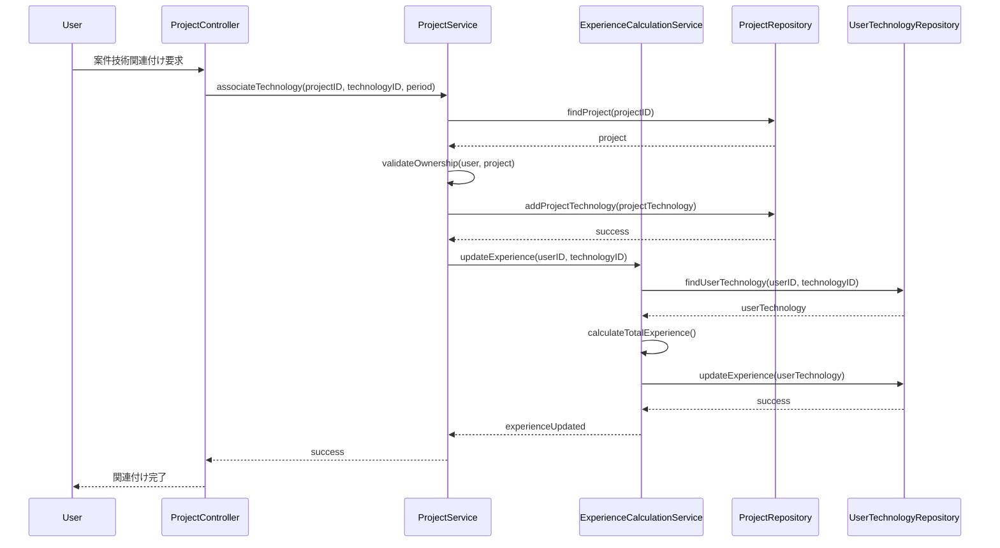
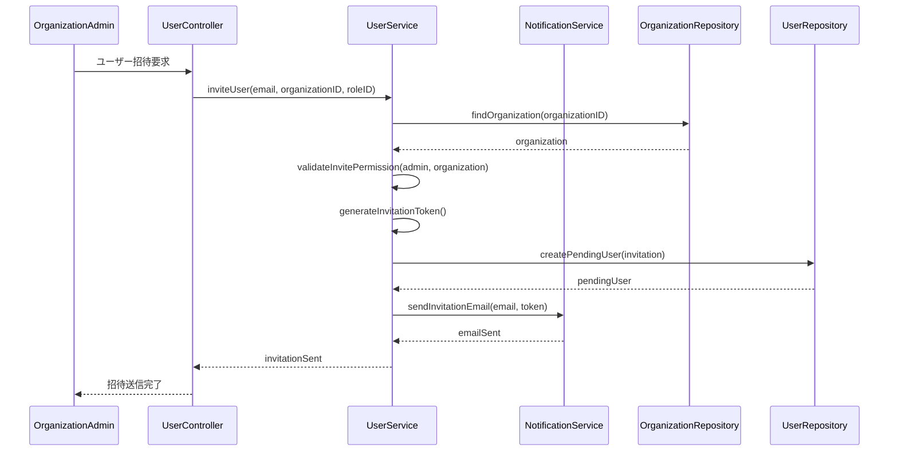

# stackies! ドメインモデリング

## 1. ドメインモデリング概要

技術スタック・案件管理システム「stackies!」のドメインモデリング設計書。
ユースケース図をもとに、主要なドメインオブジェクトとその関係性を定義し、ビジネスルールと制約を明確化する。

## 2. ドメイン分解表による分析

参考記事の手法に基づき、主要なユースケースを Subject(S), Verb(V), Object(O), Complement(C) に分解し、「ヒト・モノ・コト」で分類する。

### 2.1 案件管理領域

| ユースケース | S (主語) | V (動詞) | O (目的語) | C (補語) | 分類 |
|-------------|----------|----------|------------|----------|------|
| 案件情報登録 | エンジニア | 登録する | 案件情報 | システムに | S:ヒト, V:コト, O:モノ |
| 案件一覧表示 | エンジニア | 表示する | 案件一覧 | 画面に | S:ヒト, V:コト, O:モノ |
| 案件詳細表示 | エンジニア | 表示する | 案件詳細 | 画面に | S:ヒト, V:コト, O:モノ |
| 案件情報編集 | エンジニア | 編集する | 案件情報 | - | S:ヒト, V:コト, O:モノ |
| 案件情報削除 | エンジニア | 削除する | 案件情報 | - | S:ヒト, V:コト, O:モノ |

### 2.2 技術スタック管理領域

| ユースケース | S (主語) | V (動詞) | O (目的語) | C (補語) | 分類 |
|-------------|----------|----------|------------|----------|------|
| 技術スタック登録 | エンジニア | 登録する | 技術スタック | システムに | S:ヒト, V:コト, O:モノ |
| スキルレベル更新 | エンジニア | 更新する | スキルレベル | - | S:ヒト, V:コト, O:モノ |
| 経験年数自動更新 | システム | 更新する | 経験年数 | 自動で | S:モノ, V:コト, O:モノ |

### 2.3 案件-技術関連付け領域

| ユースケース | S (主語) | V (動詞) | O (目的語) | C (補語) | 分類 |
|-------------|----------|----------|------------|----------|------|
| 案件技術関連付け | エンジニア | 関連付ける | 案件と技術 | - | S:ヒト, V:コト, O:モノ |
| 使用期間設定 | エンジニア | 設定する | 使用期間 | - | S:ヒト, V:コト, O:モノ |
| 経験年数集計 | システム | 集計する | 経験年数 | 自動で | S:モノ, V:コト, O:モノ |

### 2.4 組織管理領域

| ユースケース | S (主語) | V (動詞) | O (目的語) | C (補語) | 分類 |
|-------------|----------|----------|------------|----------|------|
| 組織情報登録 | 組織管理者 | 登録する | 組織情報 | システムに | S:ヒト, V:コト, O:モノ |
| ユーザー招待 | 組織管理者 | 招待する | ユーザー | 組織に | S:ヒト, V:コト, O:ヒト |
| 権限設定 | 組織管理者 | 設定する | 権限 | ユーザーに | S:ヒト, V:コト, O:モノ |

## 3. ドメインオブジェクト識別

### 3.1 ヒト（Actor/Person）
`backend/domain/model`
- **エンジニア（個人ユーザー）**
- **チームリーダー**
- **組織管理者**
- **システム管理者**

### 3.2 モノ（Entity/Value Object）
`backend/domain/model`
- **案件**
- **技術スタック**
- **組織**
- **チーム**
- **プロジェクト**
- **スキルレベル**
- **経験年数**
- **権限**
- **ロール**

### 3.3 コト（Event/Service）
internal : `backend/infra/service`
- **案件登録**
- **技術登録**
- **関連付け**
- **集計処理**
- **認証**
- **認可**
- **招待**
- **統計生成**

## 4. 主要ドメインオブジェクト定義

### 4.1 ユーザー関連

#### User（ユーザー）

```go
type User struct {
    ID           UserID
    Email        Email
    Name         UserName
    Profile      UserProfile
    CreatedAt    time.Time
    UpdatedAt    time.Time
}

type UserProfile struct {
    Position     Position
    Department   Department
    JoinDate     time.Time
    Biography    string
}
```

#### Organization（組織）
```go
type Organization struct {
    ID           OrganizationID
    Name         OrganizationName
    Domain       Domain
    Settings     OrganizationSettings
    CreatedAt    time.Time
    UpdatedAt    time.Time
}

type OrganizationSettings struct {
    SubscriptionPlan  SubscriptionPlan
    MaxUsers         int
    Features         []Feature
}
```

#### Role（ロール）
```go
type Role struct {
    ID           RoleID
    Name         RoleName
    Permissions  []Permission
    Level        RoleLevel
}

type RoleLevel int

const (
    IndividualUser RoleLevel = iota
    TeamLeader
    OrganizationAdmin
    SystemAdmin
)
```

### 4.2 案件関連

#### Project（案件）
```go
type Project struct {
    ID           ProjectID
    Name         ProjectName
    Description  string
    Period       Period
    Position     Position
    Status       ProjectStatus
    Owner        UserID
    Visibility   Visibility
    CreatedAt    time.Time
    UpdatedAt    time.Time
}

type Period struct {
    StartDate    time.Time
    EndDate      *time.Time
}

type ProjectStatus string

const (
    Active    ProjectStatus = "active"
    Completed ProjectStatus = "completed"
    Archived  ProjectStatus = "archived"
)

type Visibility string

const (
    Private Visibility = "private"
    Team    Visibility = "team"
    Public  Visibility = "public"
)
```

### 4.3 技術スタック関連

#### Technology（技術）
```go
type Technology struct {
    ID           TechnologyID
    Name         TechnologyName
    Category     TechnologyCategory
    Description  string
    CreatedAt    time.Time
}

type TechnologyCategory string

const (
    ProgrammingLanguage TechnologyCategory = "programming_language"
    Framework          TechnologyCategory = "framework"
    Database           TechnologyCategory = "database"
    Infrastructure     TechnologyCategory = "infrastructure"
    Tool               TechnologyCategory = "tool"
)
```

#### UserTechnology（ユーザー技術）
```go
type UserTechnology struct {
    ID            UserTechnologyID
    UserID        UserID
    TechnologyID  TechnologyID
    SkillLevel    SkillLevel
    ExperienceYears ExperienceYears
    CreatedAt     time.Time
    UpdatedAt     time.Time
}

type SkillLevel int

const (
    Beginner     SkillLevel = 1
    Elementary   SkillLevel = 2
    Intermediate SkillLevel = 3
    Advanced     SkillLevel = 4
    Expert       SkillLevel = 5
)

type ExperienceYears float64
```

#### ProjectTechnology（案件技術関連）
```go
type ProjectTechnology struct {
    ID            ProjectTechnologyID
    ProjectID     ProjectID
    TechnologyID  TechnologyID
    UsagePeriod   Period
    Role          TechnologyRole
    CreatedAt     time.Time
    UpdatedAt     time.Time
}

type TechnologyRole string

const (
    MainTechnology    TechnologyRole = "main"
    SubTechnology     TechnologyRole = "sub"
    LearningTechnology TechnologyRole = "learning"
)
```

### 4.4 統計・分析関連

#### TechnologyStatistics（技術統計）
```go
type TechnologyStatistics struct {
    UserID         UserID
    TechnologyID   TechnologyID
    TotalExperience ExperienceYears
    ProjectCount   int
    LastUsedAt     *time.Time
    SkillTrend     SkillTrend
    GeneratedAt    time.Time
}

type SkillTrend string

const (
    Improving  SkillTrend = "improving"
    Stable     SkillTrend = "stable"
    Declining  SkillTrend = "declining"
)
```

## 5. ドメインサービス

### 5.1 ExperienceCalculationService（経験年数計算サービス）
```go
type ExperienceCalculationService interface {
    CalculateTotalExperience(userID UserID, technologyID TechnologyID) (ExperienceYears, error)
    UpdateExperienceFromProject(projectTechnologyID ProjectTechnologyID) error
    HandleOverlappingPeriods(userID UserID, technologyID TechnologyID) error
}
```

### 5.2 StatisticsGenerationService（統計生成サービス）
```go
type StatisticsGenerationService interface {
    GenerateUserStatistics(userID UserID) (*UserStatistics, error)
    GenerateTeamStatistics(teamID TeamID) (*TeamStatistics, error)
    GenerateOrganizationStatistics(orgID OrganizationID) (*OrganizationStatistics, error)
}
```

### 5.3 RecommendationService（推奨サービス）
```go
type RecommendationService interface {
    RecommendProjectMembers(projectRequirements ProjectRequirements) ([]UserID, error)
    RecommendSkillDevelopment(userID UserID) ([]TechnologyID, error)
    AnalyzeSkillGaps(teamID TeamID) (*SkillGapAnalysis, error)
}
```

## 6. 集約（Aggregate）設計

### 6.1 User Aggregate
- **集約ルート**: User
- **エンティティ**: UserProfile, UserTechnology
- **値オブジェクト**: Email, UserName, SkillLevel, ExperienceYears

### 6.2 Project Aggregate
- **集約ルート**: Project
- **エンティティ**: ProjectTechnology
- **値オブジェクト**: ProjectName, Period, ProjectStatus

### 6.3 Organization Aggregate
- **集約ルート**: Organization
- **エンティティ**: OrganizationMember, Team
- **値オブジェクト**: OrganizationName, Domain, SubscriptionPlan

## 7. ビジネスルール

### 7.1 案件管理ルール
1. 案件の期間は開始日 ≤ 終了日でなければならない
2. アクティブな案件は終了日が未設定または未来日付
3. 案件の可視性は所有者が制御する
4. チーム可視性の案件はチームメンバーのみ参照可能

### 7.2 技術スタック管理ルール
1. スキルレベルは1-5の範囲内
2. 経験年数は案件での使用期間から自動計算
3. 重複期間は最長期間で計算（同時期の複数案件での同一技術使用）
4. 技術の削除時は関連する案件技術も削除確認が必要

### 7.3 組織管理ルール
1. 組織管理者は同一組織内のユーザーのみ管理可能
2. サブスクリプションプランによりユーザー数制限
3. ドメイン認証設定時は該当ドメインのメールアドレスのみ招待可能
4. ロール変更は上位ロールのユーザーのみ実行可能

### 7.4 権限管理ルール
1. データアクセスは組織境界で厳格に分離
2. 個人データは本人とチームリーダー以上が参照可能
3. 統計データは集約レベルに応じて参照権限を制御
4. システム管理者は全組織のデータにアクセス可能

## 8. ドメインイベント

### 8.1 ユーザー関連イベント
- **UserRegistered**: ユーザー登録完了
- **UserInvited**: ユーザー招待送信
- **RoleChanged**: ロール変更
- **UserDeactivated**: ユーザー無効化

### 8.2 案件関連イベント
- **ProjectCreated**: 案件作成
- **ProjectCompleted**: 案件完了
- **ProjectTechnologyAdded**: 案件技術追加
- **ProjectTechnologyRemoved**: 案件技術削除

### 8.3 技術関連イベント
- **TechnologyRegistered**: 技術登録
- **SkillLevelUpdated**: スキルレベル更新
- **ExperienceCalculated**: 経験年数計算完了
- **StatisticsGenerated**: 統計生成完了

## 9. 実装上の考慮事項

### 9.1 マルチテナント対応
- 全ドメインオブジェクトに `OrganizationID` を含める
- データアクセス時は必ず組織フィルタを適用
- 組織間データの完全分離を保証

### 9.2 パフォーマンス考慮
- 統計データは非同期で生成・更新
- 経験年数計算は集約処理でバッチ実行
- 大量データ処理時はページネーション実装

### 9.3 拡張性
- 新しい技術カテゴリの追加に対応
- ロールベース権限の細分化可能
- 外部システム連携のためのインターフェース設計

## 10. シーケンス図

### 10.1 案件技術関連付けフロー



### 10.2 組織ユーザー招待フロー



この設計書により、stackies!システムの主要なドメインオブジェクトとビジネスロジックが明確化され、実装時の指針となる。