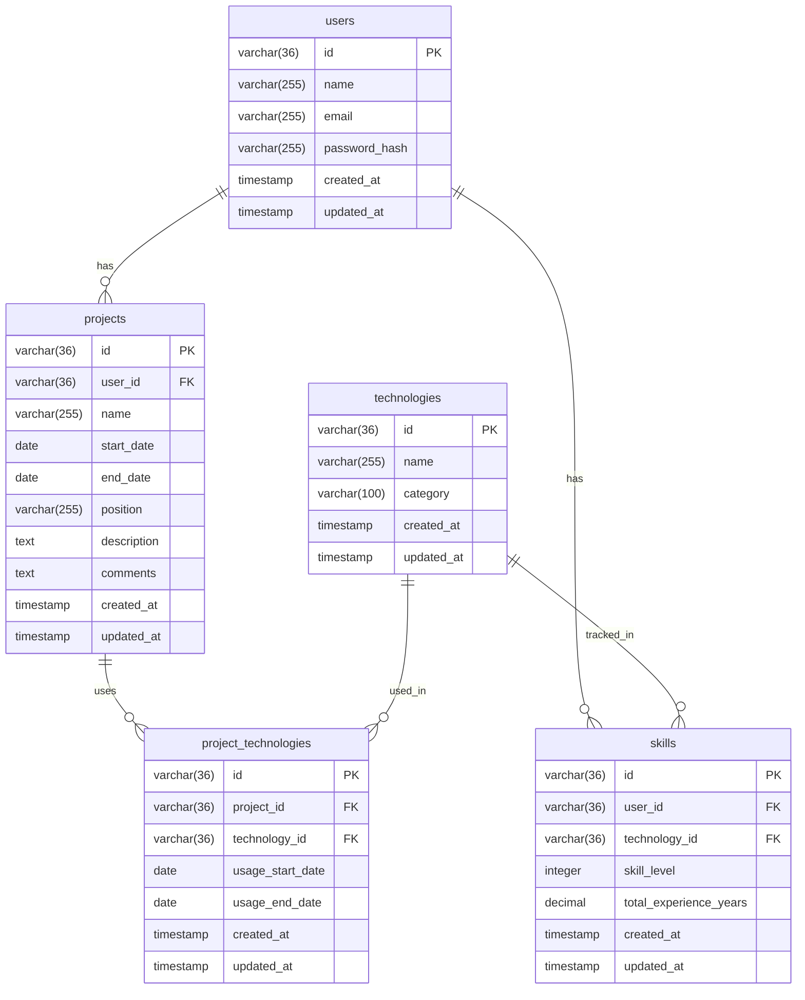

# stackies!(技術スタック・案件管理システム) データベース設計

## 1. データベース概要

技術スタック・案件管理システムのためのデータベース設計書。
要件定義に基づき、案件情報と技術スタックの管理に必要なテーブル構造を定義する。

## 2. ER図



## 3. テーブル定義

### 3.1 users（ユーザー）

| カラム名 | データ型 | 制約 | 説明 |
|----------|----------|------|------|
| id | VARCHAR(36) | PRIMARY KEY | ユーザーID（UUID） |
| name | VARCHAR(255) | NOT NULL | ユーザー名 |
| email | VARCHAR(255) | NOT NULL, UNIQUE | メールアドレス |
| password_hash | VARCHAR(255) | NOT NULL | パスワードハッシュ |
| created_at | TIMESTAMP | NOT NULL | 作成日時 |
| updated_at | TIMESTAMP | NOT NULL | 更新日時 |

### 3.2 projects（案件）

| カラム名 | データ型 | 制約 | 説明 |
|----------|----------|------|------|
| id | VARCHAR(36) | PRIMARY KEY | 案件ID（UUID） |
| user_id | VARCHAR(36) | NOT NULL, FOREIGN KEY | ユーザーID |
| name | VARCHAR(255) | NOT NULL | 案件名 |
| start_date | DATE | NOT NULL | 開始日 |
| end_date | DATE | NULL | 終了日 |
| position | VARCHAR(255) | NOT NULL | 担当ポジション |
| description | TEXT | NULL | プロジェクト概要 |
| comments | TEXT | NULL | 感想・コメント |
| created_at | TIMESTAMP | NOT NULL | 作成日時 |
| updated_at | TIMESTAMP | NOT NULL | 更新日時 |

### 3.3 technologies（技術スタック）

| カラム名 | データ型 | 制約 | 説明 |
|----------|----------|------|------|
| id | VARCHAR(36) | PRIMARY KEY | 技術ID（UUID） |
| name | VARCHAR(255) | NOT NULL, UNIQUE | 技術名 |
| category | VARCHAR(100) | NOT NULL | カテゴリ |
| created_at | TIMESTAMP | NOT NULL | 作成日時 |
| updated_at | TIMESTAMP | NOT NULL | 更新日時 |

### 3.4 skills（スキル情報）

| カラム名 | データ型 | 制約 | 説明 |
|----------|----------|------|------|
| id | VARCHAR(36) | PRIMARY KEY | スキルID（UUID） |
| user_id | VARCHAR(36) | NOT NULL, FOREIGN KEY | ユーザーID |
| technology_id | VARCHAR(36) | NOT NULL, FOREIGN KEY | 技術ID |
| skill_level | INTEGER | NOT NULL, CHECK(1-5) | スキルレベル（1-5） |
| total_experience_years | DECIMAL(4,2) | NOT NULL, DEFAULT 0 | 累計経験年数 |
| created_at | TIMESTAMP | NOT NULL | 作成日時 |
| updated_at | TIMESTAMP | NOT NULL | 更新日時 |

### 3.5 project_technologies（案件-技術関連）

| カラム名 | データ型 | 制約 | 説明 |
|----------|----------|------|------|
| id | VARCHAR(36) | PRIMARY KEY | 関連ID（UUID） |
| project_id | VARCHAR(36) | NOT NULL, FOREIGN KEY | 案件ID |
| technology_id | VARCHAR(36) | NOT NULL, FOREIGN KEY | 技術ID |
| usage_start_date | DATE | NOT NULL | 使用開始日 |
| usage_end_date | DATE | NULL | 使用終了日 |
| created_at | TIMESTAMP | NOT NULL | 作成日時 |
| updated_at | TIMESTAMP | NOT NULL | 更新日時 |

## 4. インデックス設計

### 4.1 主要インデックス

```sql
-- users テーブル
CREATE INDEX idx_users_email ON users(email);

-- projects テーブル
CREATE INDEX idx_projects_user_id ON projects(user_id);
CREATE INDEX idx_projects_start_date ON projects(start_date);
CREATE INDEX idx_projects_end_date ON projects(end_date);

-- skills テーブル
CREATE INDEX idx_skills_user_id ON skills(user_id);
CREATE INDEX idx_skills_technology_id ON skills(technology_id);
CREATE UNIQUE INDEX idx_skills_user_technology ON skills(user_id, technology_id);

-- project_technologies テーブル
CREATE INDEX idx_project_technologies_project_id ON project_technologies(project_id);
CREATE INDEX idx_project_technologies_technology_id ON project_technologies(technology_id);
CREATE UNIQUE INDEX idx_project_technologies_unique ON project_technologies(project_id, technology_id);

-- technologies テーブル
CREATE INDEX idx_technologies_category ON technologies(category);
```

## 5. 制約定義

### 5.1 外部キー制約

```sql
-- projects テーブル
ALTER TABLE projects ADD CONSTRAINT fk_projects_user_id 
    FOREIGN KEY (user_id) REFERENCES users(id) ON DELETE CASCADE;

-- skills テーブル
ALTER TABLE skills ADD CONSTRAINT fk_skills_user_id 
    FOREIGN KEY (user_id) REFERENCES users(id) ON DELETE CASCADE;
ALTER TABLE skills ADD CONSTRAINT fk_skills_technology_id 
    FOREIGN KEY (technology_id) REFERENCES technologies(id) ON DELETE CASCADE;

-- project_technologies テーブル
ALTER TABLE project_technologies ADD CONSTRAINT fk_project_technologies_project_id 
    FOREIGN KEY (project_id) REFERENCES projects(id) ON DELETE CASCADE;
ALTER TABLE project_technologies ADD CONSTRAINT fk_project_technologies_technology_id 
    FOREIGN KEY (technology_id) REFERENCES technologies(id) ON DELETE CASCADE;
```

### 5.2 チェック制約

```sql
-- skills テーブル
ALTER TABLE skills ADD CONSTRAINT chk_skill_level 
    CHECK (skill_level >= 1 AND skill_level <= 5);
ALTER TABLE skills ADD CONSTRAINT chk_total_experience_years 
    CHECK (total_experience_years >= 0);

-- projects テーブル
ALTER TABLE projects ADD CONSTRAINT chk_project_dates 
    CHECK (end_date IS NULL OR start_date <= end_date);

-- project_technologies テーブル
ALTER TABLE project_technologies ADD CONSTRAINT chk_usage_dates 
    CHECK (usage_end_date IS NULL OR usage_start_date <= usage_end_date);
```

## 6. データ整合性とビジネスルール

### 6.1 経験年数計算ルール

- 累計経験年数は project_technologies テーブルの使用期間から自動計算
- 重複期間は重複カウントしない（同一期間に複数案件で同じ技術を使用した場合）
- 案件が進行中（end_date が NULL）の場合は現在日付までで計算

### 6.2 スキルレベル管理

- スキルレベルは1-5の整数値（⭐️1〜5に対応）
- 手動更新可能
- 経験年数に基づく自動推定機能も今後実装予定

### 6.3 削除時の整合性

- ユーザー削除時は関連する全データをカスケード削除
- 技術削除時は関連するスキル情報と案件関連情報をカスケード削除
- 案件削除時は関連する技術使用情報をカスケード削除

## 7. パフォーマンス考慮事項

### 7.1 クエリ最適化

- ユーザー別の技術スタック一覧取得時のインデックス活用
- 期間指定による案件検索の最適化
- カテゴリ別技術一覧表示の最適化

### 7.2 データ量想定

- 1ユーザーあたり：
  - 案件数：年間10件程度
  - 技術スタック：50-100件程度
  - 案件-技術関連：案件あたり5-10件程度

## 8. 拡張性への配慮

### 8.1 将来の機能拡張

- 複数ユーザー対応（既に考慮済み）
- チーム・組織機能（organizations テーブル追加予定）
- スキル証明書管理（certificates テーブル追加予定）
- 外部サービス連携（integrations テーブル追加予定）

### 8.2 テーブル分割考慮

- ログ系データ（アクセスログ、操作履歴等）は別テーブルで管理
- 統計情報は materialized view または別テーブルでの管理を検討