# stackies!(技術スタック・案件管理システム) ユースケース図

## 1. ユースケース図概要

技術スタック・案件管理システムにおけるユーザーとシステムの相互作用を表現したユースケース図。
機能一覧に基づき、主要なユースケースを定義する。

## 2. ユースケース図

```mermaid
graph TD
    User[👤 ユーザー]
    System[🖥️ システム]
    
    subgraph "案件管理"
        UC1[案件情報登録]
        UC2[案件一覧表示]
        UC3[案件詳細表示]
        UC4[案件情報編集]
        UC5[案件情報削除]
    end
    
    subgraph "技術スタック管理"
        UC6[技術スタック登録]
        UC7[スキルレベル更新]
        UC8[技術スタック一覧表示]
        UC9[カテゴリ別表示]
        UC10[スキルレベル順表示]
    end
    
    subgraph "案件-技術関連付け"
        UC11[案件技術関連付け]
        UC12[使用期間設定]
        UC13[経験年数集計]
    end
    
    subgraph "統計・レポート"
        UC14[技術別経験年数ランキング]
        UC15[カテゴリ別技術分布]
        UC16[スキルレベル別一覧]
        UC17[年別案件数統計]
        UC18[ポジション別分析]
        UC19[技術トレンド分析]
    end
    
    subgraph "認証・セキュリティ"
        UC20[ユーザー認証]
        UC21[ユーザー認可]
    end
    
    User --> UC1
    User --> UC2
    User --> UC3
    User --> UC4
    User --> UC5
    User --> UC6
    User --> UC7
    User --> UC8
    User --> UC9
    User --> UC10
    User --> UC11
    User --> UC12
    User --> UC14
    User --> UC15
    User --> UC16
    User --> UC17
    User --> UC18
    User --> UC19
    User --> UC20
    
    UC1 --> UC13
    UC11 --> UC13
    UC12 --> UC13
    UC20 --> UC21
```

## 3. ユースケース詳細

### 3.1 案件管理

| ユースケース名 | アクター | 説明 | 前提条件 | 事後条件 |
|----------------|----------|------|----------|----------|
| 案件情報登録 | ユーザー | 新しい案件の情報を登録する | 認証済みユーザー | 案件情報がシステムに保存される |
| 案件一覧表示 | ユーザー | 登録済み案件の一覧を表示する | 認証済みユーザー | 案件一覧が表示される |
| 案件詳細表示 | ユーザー | 特定案件の詳細情報を表示する | 認証済みユーザー、案件が存在 | 案件詳細が表示される |
| 案件情報編集 | ユーザー | 既存案件の情報を編集する | 認証済みユーザー、案件が存在 | 案件情報が更新される |
| 案件情報削除 | ユーザー | 不要な案件情報を削除する | 認証済みユーザー、案件が存在 | 案件情報が削除される |

### 3.2 技術スタック管理

| ユースケース名 | アクター | 説明 | 前提条件 | 事後条件 |
|----------------|----------|------|----------|----------|
| 技術スタック登録 | ユーザー | 新しい技術スタックを登録する | 認証済みユーザー | 技術スタック情報が保存される |
| スキルレベル更新 | ユーザー | 技術のスキルレベルを手動更新する | 認証済みユーザー、技術が存在 | スキルレベルが更新される |
| 技術スタック一覧表示 | ユーザー | 登録済み技術スタックの一覧を表示する | 認証済みユーザー | 技術スタック一覧が表示される |
| カテゴリ別表示 | ユーザー | 技術をカテゴリ別に分類して表示する | 認証済みユーザー | カテゴリ別技術一覧が表示される |
| スキルレベル順表示 | ユーザー | 技術をスキルレベル順で表示する | 認証済みユーザー | スキルレベル順技術一覧が表示される |

### 3.3 案件-技術関連付け

| ユースケース名 | アクター | 説明 | 前提条件 | 事後条件 |
|----------------|----------|------|----------|----------|
| 案件技術関連付け | ユーザー | 案件で使用した技術を関連付ける | 認証済みユーザー、案件・技術が存在 | 案件と技術が関連付けられる |
| 使用期間設定 | ユーザー | 案件内での技術使用期間を設定する | 認証済みユーザー、関連付けが存在 | 使用期間が設定される |
| 経験年数集計 | システム | 案件での技術使用期間を累計経験年数に反映する | 案件技術関連付けが存在 | 累計経験年数が更新される |

### 3.4 統計・レポート

| ユースケース名 | アクター | 説明 | 前提条件 | 事後条件 |
|----------------|----------|------|----------|----------|
| 技術別経験年数ランキング | ユーザー | 技術別の累計経験年数をランキング表示する | 認証済みユーザー | ランキングが表示される |
| カテゴリ別技術分布 | ユーザー | カテゴリ別の技術分布統計を表示する | 認証済みユーザー | 技術分布が表示される |
| スキルレベル別一覧 | ユーザー | スキルレベル別の技術一覧を表示する | 認証済みユーザー | スキルレベル別一覧が表示される |
| 年別案件数統計 | ユーザー | 年別の案件数統計を表示する | 認証済みユーザー | 年別統計が表示される |
| ポジション別分析 | ユーザー | ポジション別の案件分析を表示する | 認証済みユーザー | ポジション別分析が表示される |
| 技術トレンド分析 | ユーザー | 期間別の技術トレンドを分析表示する | 認証済みユーザー | 技術トレンド分析が表示される |

### 3.5 認証・セキュリティ

| ユースケース名 | アクター | 説明 | 前提条件 | 事後条件 |
|----------------|----------|------|----------|----------|
| ユーザー認証 | ユーザー | システムにログインする | 有効なユーザーアカウント | 認証済み状態になる |
| ユーザー認可 | システム | ユーザーの権限を確認する | 認証済みユーザー | 適切な権限が付与される |

## 4. ユースケース関係

### 4.1 包含関係（include）

- 案件情報登録 → 経験年数集計
- 案件技術関連付け → 経験年数集計
- 使用期間設定 → 経験年数集計

### 4.2 拡張関係（extend）

- ユーザー認証 → ユーザー認可

### 4.3 汎化関係（generalization）

- 技術スタック一覧表示
  - カテゴリ別表示
  - スキルレベル順表示

## 5. アクター定義

### 5.1 主アクター

| アクター名 | 説明 | 責任 |
|------------|------|------|
| ユーザー | システムを利用するエンジニア | 案件情報と技術スタックの管理 |

### 5.2 副アクター

| アクター名 | 説明 | 責任 |
|------------|------|------|
| システム | 自動処理を行うシステム | 経験年数の自動計算、認可処理 |

## 6. ユースケースの優先度

### 6.1 高優先度（MVP機能）

1. ユーザー認証
2. 案件情報登録
3. 技術スタック登録
4. 案件技術関連付け
5. 経験年数集計

### 6.2 中優先度

1. 案件一覧表示
2. 技術スタック一覧表示
3. 案件詳細表示
4. スキルレベル更新

### 6.3 低優先度（将来実装）

1. 統計・レポート機能群
2. 高度な表示機能
3. トレンド分析機能

## 7. ユースケース実現の制約

### 7.1 技術制約

- フロントエンド：docs/frontend.md に従った実装
- バックエンド：docs/backend.md に従った実装
- データベース：sql-migrate を使用

### 7.2 セキュリティ制約

- 全ユースケースで認証・認可が必要
- データ暗号化とHTTPS通信の実装
- ユーザー固有データの適切な分離

### 7.3 パフォーマンス制約

- ページ読み込み時間：3秒以内
- 大量データ処理時の応答性確保
- 統計処理の最適化