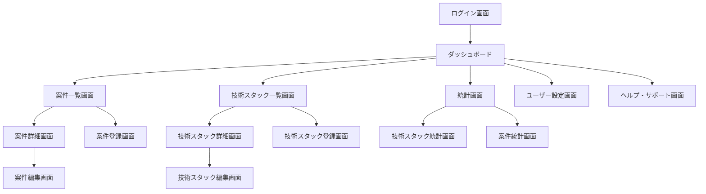

# stackies!(技術スタック・案件管理システム) 画面一覧

## 1. 画面一覧表

| カテゴリ | 画面名 | 機能 | 主要コンポーネント | 遷移先 |
|----------|--------|------|-------------------|---------|
| **認証** | ログイン画面 | ユーザー認証 | ログインフォーム、パスワードリセットリンク | ダッシュボード |
| **認証** | ユーザー登録画面 | 新規ユーザー登録 | 登録フォーム、利用規約 | ダッシュボード |
| **メイン** | ダッシュボード | システム全体の統計サマリー表示 | 技術スタック統計グラフ、最近の案件一覧、スキルレベル分布、経験年数ランキング（TOP5） | 各詳細画面 |
| **メイン** | ナビゲーションメニュー | 各画面への遷移 | グローバルナビゲーション、ユーザーメニュー | - |
| **案件管理** | 案件一覧画面 | 登録済み案件の一覧表示 | 案件リスト（案件名、期間、ポジション）、検索・フィルター機能、ソート機能、新規登録ボタン | 案件詳細画面、案件登録・編集画面 |
| **案件管理** | 案件詳細画面 | 案件の詳細情報表示 | 案件基本情報、使用技術スタック一覧、感想・コメント、編集・削除ボタン | 案件編集画面、技術スタック詳細画面 |
| **案件管理** | 案件登録画面 | 新規案件の登録 | 案件情報入力フォーム、技術スタック選択・追加、保存・キャンセルボタン | 案件詳細画面、案件一覧画面 |
| **案件管理** | 案件編集画面 | 既存案件の編集 | 案件情報編集フォーム、技術スタック編集、更新・キャンセル・削除ボタン | 案件詳細画面、案件一覧画面 |
| **技術スタック** | 技術スタック一覧画面 | 技術スタックの一覧表示 | 技術スタックリスト（技術名、カテゴリ、スキルレベル、経験年数）、カテゴリ別フィルター、スキルレベル別ソート、新規登録ボタン | 技術スタック詳細画面、技術スタック登録・編集画面 |
| **技術スタック** | 技術スタック詳細画面 | 技術スタックの詳細情報表示 | 技術基本情報、使用案件一覧、経験年数の詳細、スキルレベル更新機能、編集・削除ボタン | 技術スタック編集画面、案件詳細画面 |
| **技術スタック** | 技術スタック登録画面 | 新規技術スタックの登録 | 技術情報入力フォーム、カテゴリ選択、初期スキルレベル設定、保存・キャンセルボタン | 技術スタック詳細画面、技術スタック一覧画面 |
| **技術スタック** | 技術スタック編集画面 | 既存技術スタックの編集 | 技術情報編集フォーム、スキルレベル更新、更新・キャンセル・削除ボタン | 技術スタック詳細画面、技術スタック一覧画面 |
| **統計・レポート** | 技術スタック統計画面 | 技術スタックに関する統計表示 | 経験年数ランキング、カテゴリ別技術分布グラフ、スキルレベル別技術一覧、期間指定フィルター | 技術スタック詳細画面 |
| **統計・レポート** | 案件統計画面 | 案件に関する統計表示 | 年別案件数グラフ、ポジション別案件分析、技術トレンドチャート、期間別フィルター | 案件詳細画面 |
| **設定・その他** | ユーザー設定画面 | ユーザー情報・設定の管理 | プロフィール編集、パスワード変更、表示設定、データエクスポート機能 | - |
| **設定・その他** | ヘルプ・サポート画面 | 使い方の説明とサポート | FAQ、操作ガイド、お問い合わせフォーム | - |

## 2. 共通コンポーネント

| 種類 | コンポーネント名 | 用途 |
|------|-----------------|------|
| **モーダル・ダイアログ** | 削除確認ダイアログ | データ削除前の確認 |
| **モーダル・ダイアログ** | エラーメッセージダイアログ | エラー情報の表示 |
| **モーダル・ダイアログ** | 成功通知ダイアログ | 操作成功の通知 |
| **システム画面** | ローディング画面 | データ読み込み中の表示 |
| **システム画面** | エラー画面（404、500等） | システムエラーの表示 |
| **システム画面** | ネットワークエラー画面 | 通信エラーの表示 |

## 3. レスポンシブ対応

| デバイス | 表示特徴 | 対応内容 |
|----------|----------|----------|
| **PC版** | フル機能での表示 | サイドナビゲーション、詳細情報の同時表示 |
| **タブレット版** | 縮約されたナビゲーション | 適応的なレイアウト、タッチ操作に最適化 |
| **スマートフォン版** | ハンバーガーメニュー | モバイルファーストデザイン、必要最小限の情報表示、タップ操作に最適化 |

## 4. アクセス権限

| ユーザー種別 | アクセス可能範囲 |
|-------------|----------------|
| **認証済みユーザー** | 全機能へのアクセス可能、自身のデータの作成・編集・削除 |
| **未認証ユーザー** | ログイン画面のみアクセス可能、ユーザー登録画面へのアクセス可能 |

## 9. 画面遷移フロー

## 10. アクセス権限

### 10.1 認証済みユーザー
- 全機能へのアクセス可能
- 自身のデータの作成・編集・削除

### 10.2 未認証ユーザー
- ログイン画面のみアクセス可能
- ユーザー登録画面へのアクセス可能